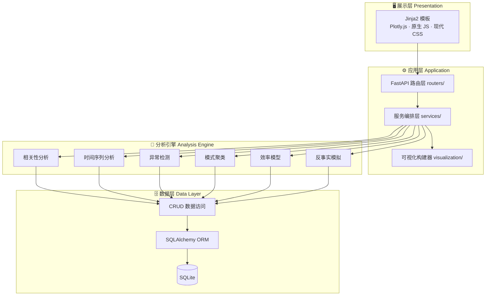
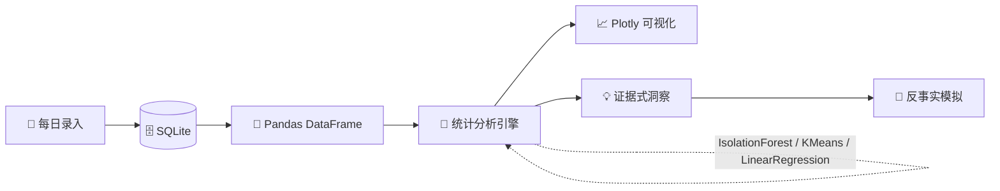
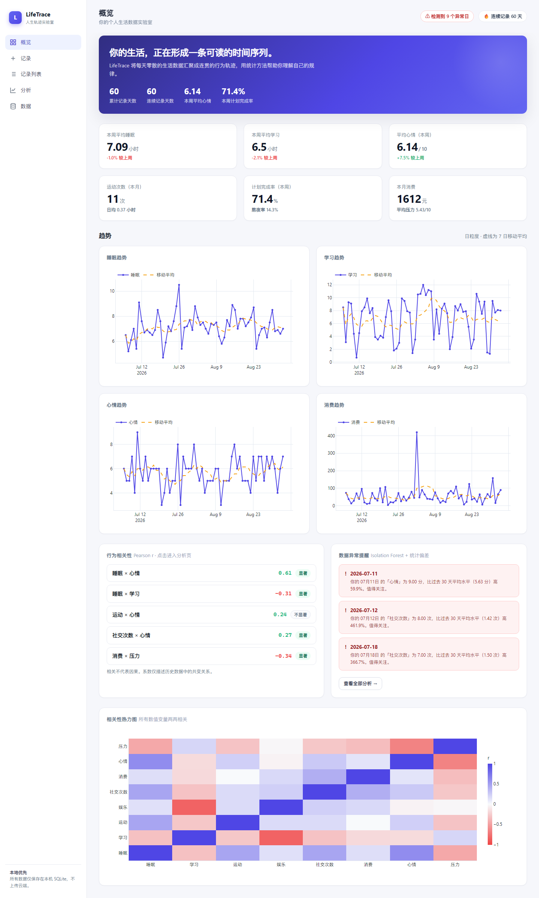
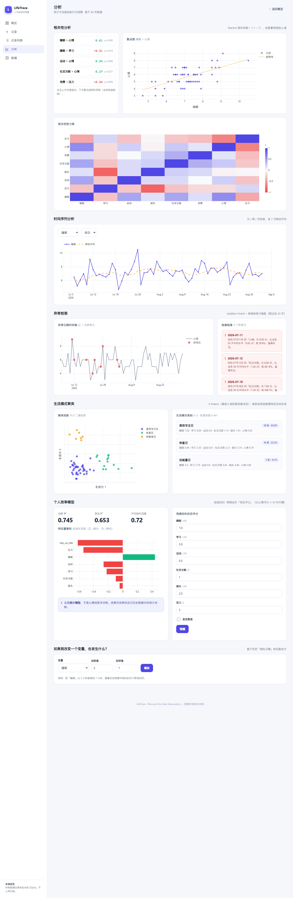
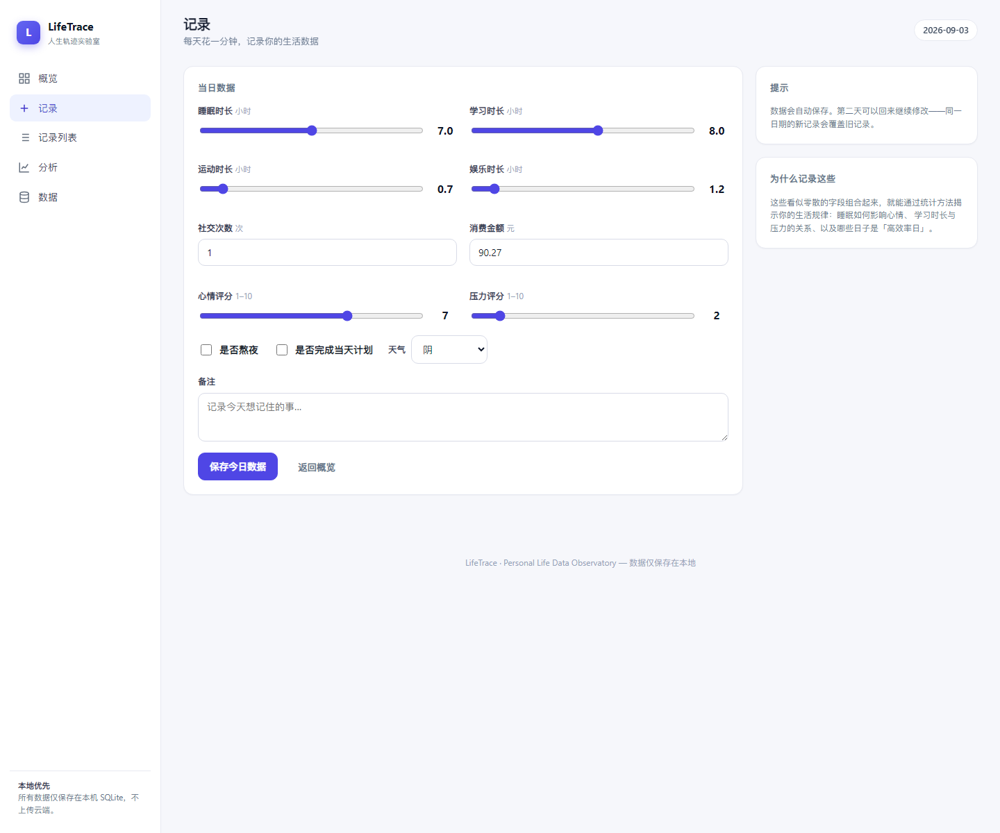
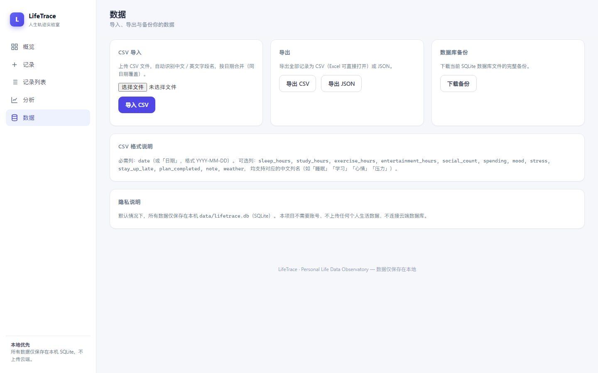

<div align="center">


# LifeTrace · 人生轨迹实验室

### Personal Life Data Observatory

**把每天的琐碎数据，沉淀成一条可读、可分析、可理解的人生轨迹。**

**—— 一套「个人行为数据实验室」，而非又一个记账 / 待办 / 打卡软件。**

<br/>

[](https://www.python.org/)
[](https://fastapi.tiangolo.com/)
[](https://www.sqlite.org/)
[](https://www.sqlalchemy.org/)
[](https://pandas.pydata.org/)
[](https://numpy.org/)
[](https://scipy.org/)
[](https://scikit-learn.org/)
[](https://plotly.com/)
[](LICENSE)
[](./tests)

**本地运行 · 零云依赖 · 数据完全私有 · 统计方法驱动**

</div>

---

## 📖 目录

1. [项目简介](#1-项目简介)
2. [项目亮点与创新点](#2-项目亮点与创新点)
3. [系统架构](#3-系统架构)
4. [界面预览](#4-界面预览)
5. [核心功能](#5-核心功能)
6. [统计方法论](#6-统计方法论)
7. [Demo 数据设计](#7-demo-数据设计)
8. [隐私设计](#8-隐私设计)
9. [快速开始](#9-快速开始)
10. [项目结构](#10-项目结构)
11. [测试与质量保障](#11-测试与质量保障)
12. [未来规划](#12-未来规划)
13. [License](#13-license)

---

## 1. 项目简介

### 一句话

> **LifeTrace 是一个把「每天一分钟的自我记录」转化为「可解释的个人行为洞察」的数据实验室。**

### 它解决的问题

我们每天都在产生行为数据，却很少有人真正"读懂"自己：为什么最近总是疲惫？学习时长和心情到底有没有关系？哪些日子是我的"高效率日"？

LifeTrace 用**真正的统计方法**（而非简单的柱状图堆砌）回答这些问题：

- 睡眠如何影响心情？
- 学习时长与压力之间存在怎样的关系？
- 我的日子可以自动分成哪几类生活模式？
- 最近哪几天与我的历史行为明显不同？

### 它不是又一个"打卡工具"

| | 记账 / 待办 / 打卡软件 | **LifeTrace** |
|---|---|---|
| 核心目标 | 记录与提醒 | **理解与洞察** |
| 数据分析 | 汇总求和、简单折线 | **相关性、聚类、异常检测、建模** |
| 输出形式 | "本月支出 XX 元" | **"你的睡眠与心情呈中等正相关（r=0.42）"** |
| 决策支持 | 无 | **反事实模拟"如果我改变一个变量"** |
| 数据主权 | 多为云端 | **完全本地，数据私有** |

---

## 2. 项目亮点与创新点

### 🎯 创新点一：反事实模拟引擎（"如果我改变一个变量"）

这是本项目**最具特色**的功能。用户选择"睡眠从 5 小时提高到 7 小时"，系统不会空洞地回复"早睡有益"，而是基于历史中**相似日期的匹配估计**，给出可量化的回答：

> 在你的历史数据中，与 7 小时睡眠相似的日期，平均学习时间提高约 **25%**，平均心情提高约 **1.2 分**。

并始终明确标注：**这是基于历史相关数据的估计，不代表因果关系。**

### 🧩 创新点二：数据驱动的聚类命名（拒绝硬编码）

生活模式聚类的类别名称**不是写死的**，而是由每个簇的实际数据特征动态生成——测量各簇在六个维度上的标准化均值，依据"主导维度 + 复合规则"命名。你的数据中若存在"社交日"，它才会被识别为"社交日"。

### 🔍 创新点三：证据式异常解释（拒绝空泛 AI 建议）

异常检测不输出"你今天状态有点差"这类废话，而是给出**带数字的证据**：

> 你的 8 月 20 日的「学习」为 1.2 小时，比过去 30 天平均水平（6.5 小时）低 81.5%。值得关注。

### 📊 创新点四：真实感 Demo 数据（蕴含人类行为规律）

首次运行自动生成的 60 天 Demo 数据**并非随机噪声**，而是内嵌了四种隐含"日类型"（高效工作日 / 恢复周末 / 社交周末 / 低能量日）、考试周压力攀升、熬夜级联导致次日效率下降等真实规律——让可视化结果**有意义**，也让聚类算法有据可依。

### 🔒 创新点五：隐私优先的架构设计

默认所有数据保存在**本机 SQLite**，无需账号、不连云端、不上传任何数据。这是个人敏感数据的正确打开方式，也是本项目的设计底线。

### 🧮 创新点六：严谨的统计方法论

每个分析模块都有明确的方法依据（Pearson 相关 + p 值、Isolation Forest、K-Means + 轮廓系数、线性回归 + R²/MAE），并**反复声明"相关不代表因果"**——这是负责任的统计产品应有的态度。

---

## 3. 系统架构

### 分层架构



### 数据分析流水线



---

## 4. 界面预览

| 概览 Dashboard | 分析 Analysis |
| :---: | :---: |
|  |  |

| 数据录入 Record | 数据管理 Data |
| :---: | :---: |
|  |  |

> 截图由 `scripts/screenshot.py` 通过无头浏览器自动生成，与代码同步更新。

---

## 5. 核心功能

### 5.1 📊 个人 Dashboard

一个现代数据产品风格的看板，一屏尽览：

- **今日状态** + **连续记录天数**
- **本周 / 本月统计**：平均睡眠、平均学习、平均心情、运动次数、计划完成率、消费趋势
- **环比变化**：本周相较上周的关键指标增减
- **数据异常提醒**：最近的异常日及原因

### 5.2 🔬 真正的统计分析

| 功能 | 统计方法 | 输出 |
|------|---------|------|
| 相关性分析 | Pearson r + p 值（显著性检验） | 睡眠×心情、睡眠×学习、运动×心情、社交×心情、消费×压力；点击任意组合查看散点图 |
| 时间序列分析 | 7 日移动平均 | 日 / 周 / 月三种粒度，任意指标切换 |
| 异常检测 | Isolation Forest + z-score | 异常日期 + 证据式解释 |
| 生活模式聚类 | K-Means（轮廓系数选 k） | "高效专注日 / 低能量日 / 恢复日 / 社交活跃日"等，名称由数据决定 |
| 个人效率模型 | 多元线性回归 | 状态评分预测 + 特征重要性排序 |

### 5.3 ✨ 特色功能：反事实模拟

```
选择变量：睡眠  当前值 5h  →  目标值 7h
┌───────────────────────────────────────────┐
│  学习时长   6.5h  →  7.9h   (上升 +21.5%) │
│  心情评分   5.8   →  7.0    (上升 +1.2分) │
│  运动时长   0.3h  →  0.6h   (上升 +100%)  │
└───────────────────────────────────────────┘
※ 基于历史相似日期的匹配估计，不代表因果关系
```

### 5.4 📥 数据导入导出

支持 **CSV 导入 / CSV 导出 / JSON 导出 / 数据库备份**。CSV 导入自动识别中英文字段名，按日期合并（同日期覆盖）。

---

## 6. 统计方法论

> 完整公式与推导见 [docs/statistics.md](docs/statistics.md)。此处列出核心要点。

### 6.1 相关系数（Pearson r）

$$r = \frac{\sum (x_i - \bar{x})(y_i - \bar{y})}{\sqrt{\sum (x_i - \bar{x})^2 \sum (y_i - \bar{y})^2}}$$

同时计算双侧检验的 **p 值**（p < 0.05 视为统计显著），并标注样本量 n。

### 6.2 移动平均（7 日窗口）

$$MA_t = \frac{x_{t-6} + x_{t-5} + \cdots + x_t}{7}$$

### 6.3 异常检测

**双信号融合**：
1. **Isolation Forest**：在标准化多维特征空间中孤立每个日期，越易被孤立越异常（无需假设分布）；
2. **单指标 z-score**：$$z = \frac{x - \mu}{\sigma}$$，μ、σ 为过去 30 天基线均值与标准差，|z| ≥ 2.5 时标记。

### 6.4 生活模式聚类

在「睡眠 / 学习 / 运动 / 社交 / 娱乐 / 心情」六维上做 **K-Means**，k 由**轮廓系数（Silhouette）**在 2~6 间自动选取。类别名称由簇内特征标准化均值动态生成。

### 6.5 个人效率模型

多元线性回归 $$\hat{y} = \beta_0 + \sum \beta_i x_i$$，以「睡眠 / 学习 / 运动 / 社交 / 娱乐 / 压力 / 是否熬夜」预测「状态评分」（心情评分代理）。报告 **R²**（解释力）与 **MAE**（平均绝对误差），系数经标准化后用于重要性排序。

> ⚠️ **相关不代表因果。** 所有结果均为描述性 / 相关性分析，不构成心理或医学诊断。

---

## 7. Demo 数据设计

首次运行自动生成 **60 天**真实感 Demo 数据，内嵌四种隐含"日类型"：

| 日类型 | 特征 |
|--------|------|
| 🎯 高效工作日 | 学习 8h+、睡眠规律、娱乐克制 |
| 🛌 恢复周末 | 睡眠 9h、学习减少、情绪愉悦 |
| 🎉 社交周末 | 社交频繁、消费偏高 |
| 🔋 低能量日 | 熬夜级联后：睡眠不足、情绪低落、效率下降 |

外加一个**考试周**（压力 + 学习同步攀升）与**偶发消费异常**，让聚类与异常检测"有的放矢"。

```bash
# 手动生成 / 重置 Demo 数据
python scripts/generate_demo_data.py --days 90 --reset
```

---

## 8. 隐私设计

| 原则 | 实现 |
|------|------|
| 本地优先 | 数据默认保存在本机 `data/lifetrace.db`（SQLite） |
| 零账号 | 无需注册、无登录 |
| 零上传 | 不连接任何云端数据库、不采集任何数据 |
| 数据自主 | 随时导出 CSV / JSON 或直接删除本地数据库文件 |

---

## 9. 快速开始

### 环境要求

- Python **3.11+**

### 安装

```bash
git clone https://github.com/<your-username>/LifeTrace.git
cd LifeTrace

# 创建虚拟环境（推荐）
python -m venv .venv
source .venv/bin/activate        # Windows: .venv\Scripts\activate

# 安装依赖
pip install -r requirements.txt
```

### 运行

```bash
python run.py
```

浏览器访问 **http://127.0.0.1:8000**。首次启动自动生成 Demo 数据。

### 运行测试

```bash
pip install pytest httpx
pytest
```

---

## 10. 项目结构

```
LifeTrace/
├── app/                      # 应用核心
│   ├── main.py               # FastAPI 入口（含启动钩子）
│   ├── config.py             # 配置（路径 / 数据库 URL）
│   ├── database.py           # 引擎 / 会话 / Base
│   ├── models.py             # SQLAlchemy 模型
│   ├── schemas.py            # Pydantic 校验模型
│   ├── crud.py               # 数据访问层
│   ├── seed.py               # Demo 数据自动播种
│   ├── demo.py               # 真实感数据生成器
│   ├── stats.py              # 纯统计工具（可单测）
│   ├── services.py           # 服务编排层
│   ├── visualization.py      # Plotly 图表构建器
│   ├── analysis/             # 🧠 统计分析引擎
│   │   ├── correlation.py    #   相关性（Pearson r + p）
│   │   ├── timeseries.py     #   时间序列 / 移动平均
│   │   ├── anomaly.py        #   异常检测（Isolation Forest + z-score）
│   │   ├── clustering.py     #   生活模式聚类（数据驱动命名）
│   │   ├── efficiency.py     #   效率模型（线性回归）
│   │   └── whatif.py         #   反事实模拟
│   └── routers/              # API + 页面路由
│       ├── records.py        #   记录 CRUD
│       ├── dashboard.py      #   看板
│       ├── analysis.py       #   分析接口
│       └── io.py             #   导入 / 导出 / 备份
├── templates/                # Jinja2 模板
├── static/                   # CSS / JS / plotly.js（离线内置）
├── tests/                    # pytest 测试套件（28 个用例）
├── scripts/                  # Demo 数据生成、截图脚本
├── data/                     # SQLite 数据库（本机，不提交）
├── docs/                     # 统计方法论文档 + banner
├── screenshots/              # 界面截图
├── requirements.txt
├── .gitignore
├── LICENSE
└── README.md
```

---

## 11. 测试与质量保障

项目内置 **28 个自动化测试**，覆盖：

| 测试类别 | 覆盖内容 |
|---------|---------|
| 数据库 | 建表、唯一约束、会话 |
| 数据录入 | 创建 / 更新 / 删除 / 边界校验 |
| 统计计算 | Pearson 相关、移动平均、连续天数、聚类、效率模型、反事实模拟 |
| 异常检测 | 植入异常点的检出、均匀数据不误报 |
| API | 各端点的状态码与返回结构 |

```bash
pytest          # 28 passed
```

此外，项目遵循分层架构（路由 → 服务 → 分析引擎 → 数据访问），核心统计函数均为**纯函数**，可独立单测。

---

## 12. 未来规划

- [ ] 移动端 PWA 支持
- [ ] 季节性分解（STL）与贝叶斯变化点检测
- [ ] 目标设定与智能提醒
- [ ] 多用户档案
- [ ] Docker 一键部署

---

## 13. License

[MIT](LICENSE) © 2026 LifeTrace contributors

---

<div align="center">

**LifeTrace · 人生轨迹实验室** —— *Understand your life, not just record it.*

</div>
